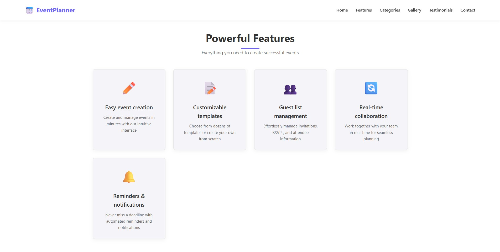
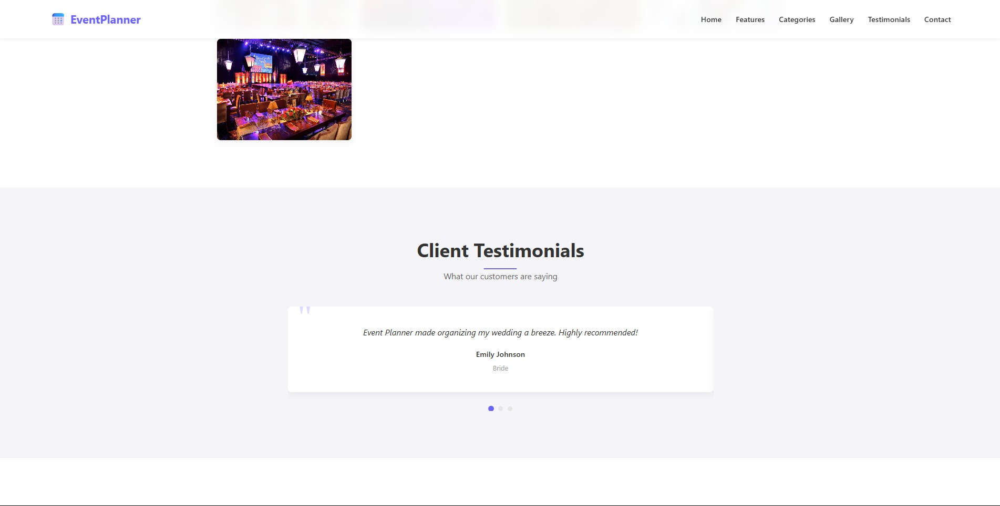

# EventPlanner

### Live Website 🌐 : https://tharunm-event-planner.vercel.app/

A modern, responsive event planning web application built with React and Vite. Easily organize, manage, and showcase events of all types—from birthdays to corporate meetings.

---

## Features

- **Easy Event Creation:** Intuitive interface for creating and managing events in minutes.
- **Customizable Templates:** Choose from dozens of templates or create your own.
- **Guest List Management:** Effortlessly manage invitations, RSVPs, and attendee information.
- **Real-Time Collaboration:** Work together with your team for seamless planning.
- **Reminders & Notifications:** Automated reminders so you never miss a deadline.
- **Event Gallery:** Showcase past events with a beautiful image gallery.
- **Client Testimonials:** Rotating slider of customer feedback.
- **Contact Form:** Built-in form for inquiries and support.
- **Responsive Design:** Works great on desktop and mobile.

---

## Screenshots








---

## Getting Started

### Prerequisites
- [Node.js](https://nodejs.org/) (v16+ recommended)
- [npm](https://www.npmjs.com/) or [yarn](https://yarnpkg.com/)

### Installation

```bash
# Clone the repository
$ git clone https://github.com/Tharun151425/event_planner.git
$ cd event_planner

# Install dependencies
$ npm install
# or
yarn install
```

### Running Locally

```bash
# Start the development server
$ npm run dev
# or
yarn dev
```

Open [http://localhost:5173](http://localhost:5173) in your browser to view the app.

---

## Project Structure

```
├── public/
│   ├── img1.jpg
│   ├── img2.jpg
│   ├── img3.jpg
│   └── ...
├── src/
│   ├── App.jsx
│   ├── App.css
│   ├── index.css
│   ├── main.jsx
│   └── Components/
│       ├── EventPlanner.jsx
│       ├── EventPlanner.css
│       ├── EventClock.jsx
│       ├── EventClock.module.css
│       ├── useFetch.jsx
│       ├── useFetch.css
│       └── footer.jsx
├── index.html
├── package.json
├── vite.config.js
└── README.md
```

---

## Deployment

You can deploy this app easily to [Vercel](https://vercel.com/), [Netlify](https://netlify.com/), or any static hosting provider.

1. Build the app:
   ```bash
   npm run build
   # or
   yarn build
   ```
2. Upload the `dist/` folder to your hosting provider.

---

## Author

**Tharun151425**  
GitHub: [Tharun151425](https://github.com/Tharun151425)

---

## License

This project is licensed under the MIT License. See the [LICENSE](LICENSE) file for details.

---

## Contributing

Pull requests are welcome! For major changes, please open an issue first to discuss what you would like to change.

---

## Contact

For questions or support, please reach out via [GitHub Issues](https://github.com/Tharun151425/event_planner/issues) or email info@eventplanner.com.

---

## Acknowledgements

- React
- Vite
- [Unsplash](https://unsplash.com/) for placeholder images

---

## Social

- [Facebook](#facebook)
- [Twitter](#twitter)
- [Instagram](#instagram)
- [LinkedIn](#linkedin)

---

## FAQ

See the [FAQ](#faq) section in the app footer for common questions.

---

## Enjoy planning your next event with EventPlanner!